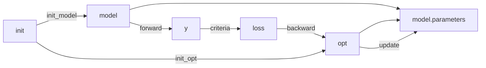
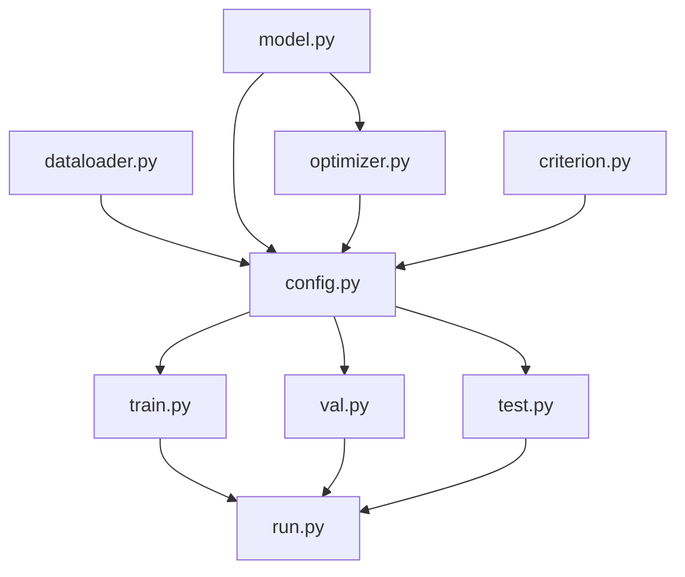

### 6 key api of pytorch
- model = Model(arg_model) # 1. model
- opt = Optimizer(arg_opt, model.parameters()) # 2. optimizer
- y = model(x) # 3. forward
- loss = loss_f(y, t) # 4. criterion
- loss.backward() # 5. backward
- opt.step() # 6. update

### model training

### files structure
